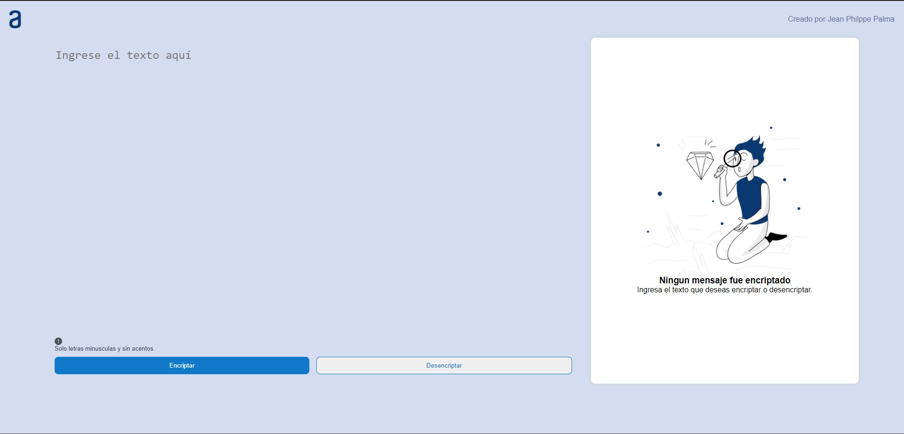
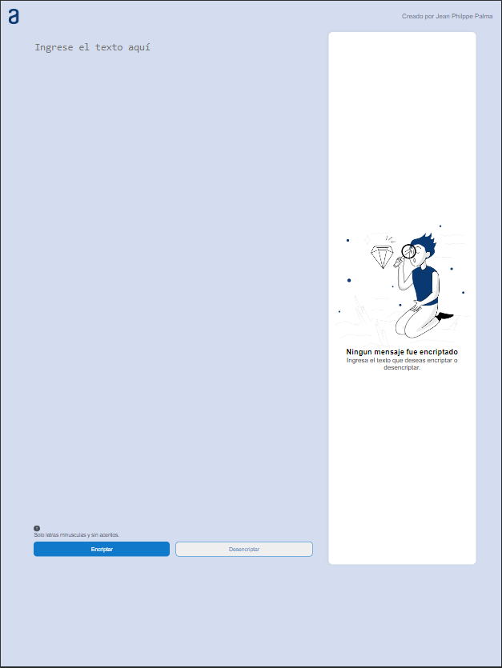
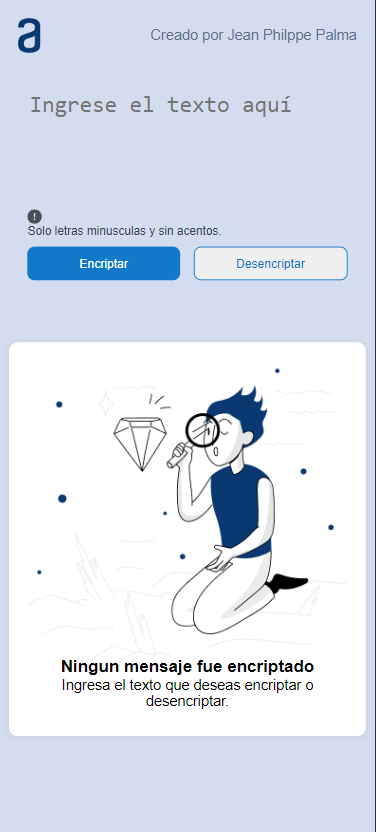

  

# Projecto Decodificador - Programa One Next Education

Decodificador de texto, un proyecto desarrollado como parte del programa de formación One Next Education de Oracle en colaboración con Alura, centrado en la aplicación de los conocimientos obtenidos durante el curso de formación T6 - ONE Principiante en Programación.

## Responsividad del proyecto

### Pantalla del Computador

  

### Pantalla de la Tablet

  

### Pantalla del Celular

  

